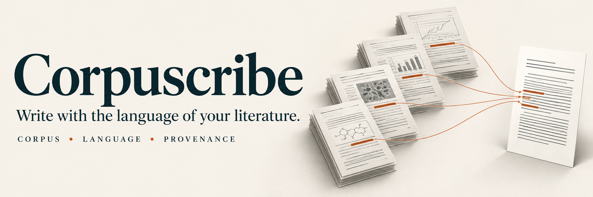
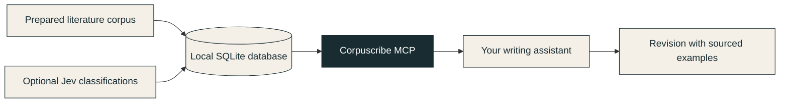

<p align="center">
  
</p>

<p align="center">
  <a href="https://github.com/tofunori/corpuscribe/actions/workflows/ci.yml"></a>
  <a href="LICENSE"></a>
  
  
</p>

<p align="center">
  <strong>A scientific writing companion grounded in your literature.</strong><br>
  Find the wording. Inspect the examples. Keep the source.
</p>

<p align="center">
  <a href="#quick-start">Quick start</a> ·
  <a href="#three-tools-one-corpus">Tools</a> ·
  <a href="docs/database.md">Database guide</a> ·
  <a href="CONTRIBUTING.md">Contributing</a>
</p>

---

## Let your literature inform your language

How do researchers express uncertainty? Is a formulation common across several papers, or repeated in just one? What wording accompanies a particular kind of estimate?

Corpuscribe brings those questions into your AI writing workflow. Its local MCP server searches a prepared literature database, compares formulations, and returns sentences with their article and page references. Your writing assistant uses those examples to suggest revisions you can inspect.

| Find the wording | Keep the context | Check the evidence |
| :--- | :--- | :--- |
| Compare formulations across articles. | Filter examples using existing Jev classifications. | Return article identifiers, pages and source identifiers. |

**Early release · v0.1.** Three read-only tools are available today. PDF ingestion, paragraph revision and automatic classification are outside this server's current scope.

## From literature to a revision



The server queries saved data. It makes no model calls and requires no API key. An optional upstream classifier can attach rhetorical labels before you search.

## Quick start

Use Node.js 22 or newer for the documented setup. The repository's CI tests Node.js 22.

```bash
git clone https://github.com/tofunori/corpuscribe.git
cd corpuscribe
npm ci
npm run build
```

Point the server at an existing compatible database, or try the included **fictional two-sentence corpus** with Python 3:

```bash
python3 - <<'PY'
import sqlite3
from pathlib import Path
path = Path('data/demo.sqlite')
path.parent.mkdir(exist_ok=True)
if path.exists():
    raise SystemExit('Demo database already exists; use it without recreating it.')
with sqlite3.connect(path) as db:
    db.executescript(Path('examples/demo.sql').read_text())
PY
node dist/server.js --database "$PWD/data/demo.sqlite"
```

The server uses **stdio**: it waits for an MCP client rather than opening a webpage or an interactive terminal prompt.

### Connect your assistant

Add this entry to a client that accepts an `mcpServers` configuration, replacing the two paths with absolute paths on your machine:

```json
{
  "mcpServers": {
    "corpuscribe": {
      "command": "node",
      "args": [
        "/absolute/path/to/corpuscribe/dist/server.js",
        "--database",
        "/absolute/path/to/linguistic.sqlite"
      ]
    }
  }
}
```

You can alternatively supply the database path through `CORPUSCRIBE_DB`. The server does not automatically load `.env` files. Client configuration formats vary; the JSON above is a configuration example, not an automatic installer.

## Three tools, one corpus

| Tool | What it returns | Example input |
| :--- | :--- | :--- |
| `corpus_status` | Eligible sentence, article and source counts; stored Jev coverage. | `{}` |
| `corpus_search` | Up to 50 matching sentences with provenance and optional label filters. | `{"query":"may underestimate","limit":5}` |
| `terminology_compare` | Matching sentence counts, distinct article/source counts and up to three examples per term. | `{"terms":["upper bound","maximum estimate"]}` |

### Find cautious language

Call `corpus_search` with:

```json
{
  "query": "underestimate",
  "limit": 5,
  "rhetoricalFilters": [
    { "label": "certainty", "choice": "possible", "minProbability": 0.9 }
  ]
}
```

The fictional demo corpus returns this sentence inside the tool's result:

```json
{
  "id": "demo-1",
  "article": "demo:paper-a",
  "title": "Fictional snow study",
  "pagePdf": 4,
  "sourceId": "demo:source-a",
  "text": "These assumptions may underestimate melt.",
  "wordCount": 6
}
```

In a writing session, try: **“Find examples of ‘may underestimate’, show their sources, and use them to suggest a cautious revision of my sentence.”** The assistant proposes the revision; Corpuscribe supplies the examples.

## Read the counts correctly

- Search is **case-insensitive substring matching**, not semantic retrieval or whole-word matching. PDF line breaks can affect phrase matches.
- `occurrences` currently counts **matching sentences**, not individual repetitions of a term.
- Article counts help distinguish broad usage from repeated wording in one source. Source duplication depends on the upstream database.
- A common expression is evidence of usage, not proof of scientific correctness or a universal style rule.
- Jev labels are optional, probabilistic and dependent on upstream coverage. This version does not select a classifier schema: use an index containing one intended schema to avoid mixing label versions.

See the [database contract](docs/database.md) for required columns and coverage definitions.

## Your corpus stays under your control

The SQLite connection is read-only. The repository contains code and fictional examples; personal databases, PDFs and environment files are ignored by Git.

Retrieved sentences are returned to your MCP client. If that client uses a hosted model, the excerpts it includes in its prompts may be sent to that provider. Choose a client appropriate for your corpus.

## Development

```bash
npm test
npm run check
npm run build
```

Tests use a synthetic SQLite fixture. See [Contributing](CONTRIBUTING.md) for reporting problems and proposing changes.

### Next directions

- Linguistic feature queries for verbs, adverbs and connectors.
- Richer classification provenance and schema selection.
- Corpus-aware paragraph diagnostics.
- Easier corpus preparation and onboarding.

These are planned directions, not tools available in v0.1.

---

<p align="center"><strong>Write with the language of your literature.</strong><br>Open source · <a href="LICENSE">MIT license</a></p>
